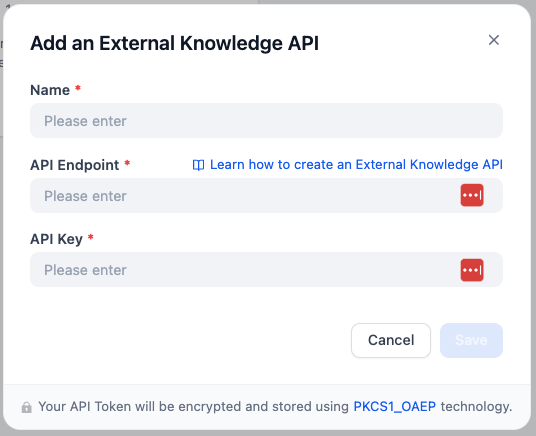

# Dify on AWS with CDK

[](https://github.com/aws-samples/dify-self-hosted-on-aws/actions/workflows/build.yml)

Self-host [Dify](https://dify.ai/), an LLM app development platform, using AWS managed services with AWS CDK.


Key Features:

* Fully managed services requiring less maintenance effort
    * Aurora servereless v2, ElastiCache, ECS Fargate, etc.
* Cost effective architectural decisions
    * allow to use NAT instances instead of NAT Gateway, and Fargate spot capacity by default
* Easily integrate with Bedrock models and Knowledge Bases

本リポジトリの使い方について、日本語で書かれた記事もあります: 
* [AWS CDKでDifyを一撃構築](https://note.com/yukkie1114/n/n0d9c5551569f) ( [CloudShell版](https://note.com/yukkie1114/n/n8e055c4e7566) )
* [AWSマネージドサービスで Dify のセルフホスティングを試してみた](https://dev.classmethod.jp/articles/dify-self-hosting-aws/)

## Prerequisites
You must have the following dependencies installed to deploy this app:

* [Node.js](https://nodejs.org/en/download/) (v18 or newer)
* [Docker](https://docs.docker.com/get-docker/)
* [AWS CLI](https://docs.aws.amazon.com/cli/latest/userguide/getting-started-install.html) and IAM profile with Administrator policy

## Deploy
You can adjust configuration parameters such as AWS regions by modifying [`bin/cdk.ts`](bin/cdk.ts). Please also check [`EnvironmentProps` interface](./lib/environment-props.ts) for all the available parameters.

Then you can run the following commands to deploy the entire stack.

```sh
# install npm dependencies
npm ci
# bootstrap the AWS account (required only once per account and region)
npx cdk bootstrap
# deploy the CDK stack
npx cdk deploy --all
```

The initial deployment usually takes about 20 minutes. After a successful deployment, you will get the URL for the app.

```
 ✅  DifyOnAwsCdkStack

✨  Deployment time: 326.43s

Outputs:
DifyOnAwsStack.DifyUrl = https://dify.example.com
```

You can open the URL with a browser and get started!

### Deploy from CloudShell

When you deploy from CloudShell, you can use a dedicated script that works even in an environment with limited storage space.

In CloudShell, run the following commands:

```sh
git clone https://github.com/aws-samples/dify-self-hosted-on-aws.git
./simple-deploy.sh
```

Then follow the prompts from the shell script. You will finally get the `DifyOnAwsStack.DifyUrl` output in the CLI.

## Tips

Here is the information that might help when you use Dify on AWS.

### Setup Dify to use Bedrock

After logged in, you can setup Dify to use Bedrock LLMs.

> [!IMPORTANT]  
> Before setting up models in Dify, you have to **enable models** you want to use in Bedrock management console. Please read [this document](https://docs.aws.amazon.com/bedrock/latest/userguide/model-access.html#model-access-add) for more details.

Go to settings by clicking the right-top profile, click `WORKSPACE -> Model Provider`, and select `AWS Bedrock model`.

IAM policies are already configured properly, so you can just select a correct AWS region (where the models are enabled) to use Bedrock models, and click `Save`.


### Add Python packages available in code execution

You can add Python packages that is available in Dify code execution feature. Edit [python-requirements.txt](./lib/constructs/dify-services/docker/python-requirements.txt) following the [Requirements File Format](https://pip.pypa.io/en/stable/reference/requirements-file-format/).

In some libraries, you have to allow additonal system calls in Dify sandbox. This CDK project let you to allow all the system calls by `allowAnySysCalls` flag in [`bin/cdk.ts`](bin/cdk.ts).

> [!WARNING]
> If you enable `allowAnySysCalls` flag, please make sure that code executed in your Dify tenant can be fully trusted.

Please also refer to this blog article for more details: [Using any Python libraries in Dify's code block](https://tmokmss.hatenablog.com/entry/use-any-python-packages-on-dify-sandbox)

### Connect to Bedrock Knowledge Bases

You can use the [External Knowledge Base feature](https://docs.dify.ai/guides/knowledge-base/connect-external-knowledge) to connect to [Amazon Bedrock Knowledge Bases](https://aws.amazon.com/bedrock/knowledge-bases/). Because the external knowledge API is deployed as a sidecar of Dify API, you can use the feature immediately with the following steps:

1. Click Dify -> Knowledge -> Add an External Knowledge API button.
    * 
2. Fill the form as below:
    1. Name: any name as you like (e.g. `Bedrock Knowledge Bases`)
    2. API Endpoint: `http://localhost:8000`
    3. API Key: `dummy-key` (you can configure it by editing `BEARER_TOKEN` environment variable in [`api.ts`](./lib/constructs/dify-services/api.ts).)
3. Click Dify -> Knowledge -> Create Knowledge -> Connect to an External Knowledge Base
    * 
4. Fill the form as below
    1. External Knowledge Name / Knowledge Description: any string
    2. External Knowledge API: the external API you created in the previous step
    3. External Knowledge ID: The Bedrock Knowledge Base ID you want to use. The AWS region is us-west-2 by default, but you can override the AWS region by adding region prefix with colon, e.g. `us-east-1:QWERTYASDF`.
5. Now you can use the knowledge from Dify tools.

For more information, please refer to this article: [Dify can also do RAG on documents with charts and graphs!](https://qiita.com/mabuchs/items/85fb2dad19ec441c870c)

### Scaling out / Scaling up

Although this system is designed with infrastructure scalability in mind, there are several tuning knobs that you might want to explicitly set as you prepare for larger numbers of users.

The below are the list of configurable parameters and their default values:

1. ECS Task ([api.ts](./lib/constructs/dify-services/api.ts), [web.ts](./lib/constructs/dify-services/web.ts))
    1. Size
        1. api/worker: 1024vCPU / 2048MB
        2. web: 256vCPU / 512MB
    2. Desired Count
        1. 1 task for each service
2. ElastiCache ([redis.ts](./lib/constructs/redis.ts))
    1. Node Type: `cache.t4g.micro`
    2. Node Count: 1
3. Aurora Postgres ([postgres.ts](./lib/constructs/postgres.ts))
    1. Serverless v2 maximum capacity: 2 ACU

### Deploying to a closed network (a.k.a 閉域要件)

To deploy this project on a closed network (a VPC without Internet gateway or NAT gateway), you can follow the steps below:

1. Set configuration parameters in `bin/cdk.ts` as below:
    ```ts
    export const props: EnvironmentProps = {
        // set region and account you want to deploy.
        awsRegion: 'ap-northeast-1',
        awsAccount: '123456789012',

        // Set your internal IP address ranges here.
        allowedIPv4Cidrs: ['10.0.0.0/16'],

        // The below two flags must be set.
        useCloudFront: false,
        internalAlb: true,

        // If you cannot access Docker Hub from your vpc subnets, set this property.
        customEcrRepositoryName: 'dify-images',

        // Optionally you can import an existing VPC.
        vpcId: 'vpc-12345678',

        // Or you want to let the CDK create VPC, set this property.
        vpcIsolated: true,

        // Other properties can be configured as you like.
    };
    ```

2. Open [`python-requirements.txt`](lib/constructs/dify-services/docker/sandbox/python-requirements.txt) and remove all the dependencies from it
    * This is **only required** if you cannot access [PyPI](https://pypi.org/) from your vpc subnets.
3. Copy all the dify container images in Docker Hub to an ECR repository.
    * To do this, you can simply run `npx ts-node scripts/copy-to-ecr.ts`. (You will also need to run `npm ci` before this.)
        * This script must be executed in an environment that has access to the Internet.
        * This script must be executed every time you change `difyImageTag` or `difySandboxImageTag` property.
    * This is **only required** if you cannot access [Docker Hub](https://www.docker.com/products/docker-hub/) from your vpc subnets.
4. If you are using an existing VPC (`vpcId` property), make sure the required VPC endpoints are provisioned before deployment.
    * See [vpc-endpoints.ts](lib/constructs/vpc-endpoints.ts) for the list of required VPC endpoints.
5. Deploy the CDK project following the [Deploy](#deploy) section.
6. After the deployment, please configure Bedrock in Dify with the same AWS region as your VPC.
    * e.g. `ap-northeast-1` in the example above.


## Clean up
To avoid incurring future charges, clean up the resources you created.

```sh
npx cdk destroy --force
# If you encountered an error during the deletion, please retry. It happens sometimes.
```

If you set `customEcrRepositoryName` and have run the `copy-to-ecr.ts` script, please remove the container repository and images in it manually.

## Cost

The following table provides a sample cost breakdown for deploying this system in the us-east-1 (N. Virginia) region for one month (when deployed using cheap configuration).


| AWS service | Dimensions | Cost [USD] |
| --------------------| ----------------- | -------------------------------|
| RDS Aurora | Postgres Serverless v2 (0 ACU) | $0 |
| ElastiCache | Valkey t4g.micro | $9.2 |
| ECS (Fargate) | Dify-web 1 task running 24/7 (256CPU) | $2.7 |
| ECS (Fargate) | Dify-api/worker 1 task running 24/7 (1024CPU) | $10.7 |
| Application Load Balancer | ALB-hour per month | $17.5 |
| VPC | NAT Instances t4g.nano x1 | $3.0 |
| TOTAL | estimate per month | $43.1 |

Note that you have to pay LLM cost (e.g. Amazon Bedrock ) in addition to the above, which totally depends on your specific use case.

## Security

See [CONTRIBUTING](CONTRIBUTING.md#security-issue-notifications) for more information.

## License

This library is licensed under the MIT-0 License. See the LICENSE file. You should also check [Dify's license](https://github.com/langgenius/dify/blob/main/LICENSE).

## Acknowledgement
This CDK code is heavily inspired by [dify-aws-terraform](https://github.com/sonodar/dify-aws-terraform).
