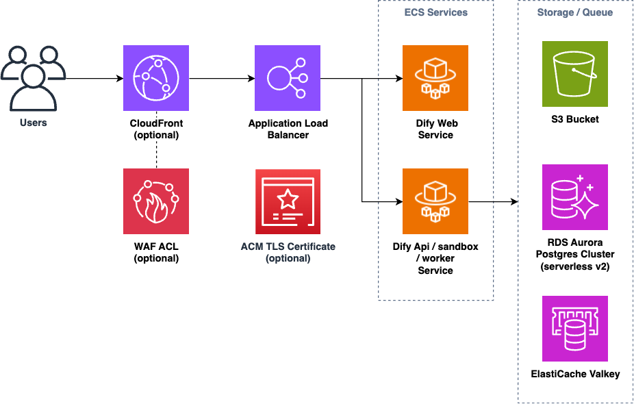

# Dify on AWS with CDK

[](https://github.com/aws-samples/dify-self-hosted-on-aws/actions/workflows/build.yml)

Self-host [Dify](https://dify.ai/), an LLM app development platform, using AWS managed services with AWS CDK.



Key Features:

* Fully managed services requiring less maintenance effort
    * Aurora servereless v2, ElastiCache, ECS Fargate, etc.
* Cost effective architectural decisions
    * allow to use NAT instances instead of NAT Gateway, and Fargate spot capacity by default
* Easily integrate with Bedrock models and Knowledge Bases

## Quick Start

For a quick and convenient deployment, you can use the one-click deployment option available at:
* [One-Click Deployment for Dify on AWS](https://aws-samples.github.io/sample-one-click-generative-ai-solutions/en/solutions/dify/)

本リポジトリの使い方について、日本語で書かれた資料もあります: 
* [Dify on AWS 環境構築手順 (スライド形式)](https://speakerdeck.com/yosse95ai/dify-on-aws-huan-jing-gou-zhu-shou-shun)
* [AWS CDKでDifyを一撃構築](https://note.com/yukkie1114/n/n8e055c4e7566)
* [AWSマネージドサービスで Dify のセルフホスティングを試してみた](https://dev.classmethod.jp/articles/dify-self-hosting-aws/)

## Prerequisites
You must have the following dependencies installed to deploy this app:

* [Node.js](https://nodejs.org/en/download/) (v18 or newer)
* [Docker](https://docs.docker.com/get-docker/)
* [AWS CLI](https://docs.aws.amazon.com/cli/latest/userguide/getting-started-install.html) and IAM profile with Administrator policy

## Deploy
You can adjust configuration parameters such as AWS regions by modifying [`bin/cdk.ts`](bin/cdk.ts). Please also check [`EnvironmentProps` interface](./lib/environment-props.ts) for all the available parameters.

Then you can run the following commands to deploy the entire stack.

```sh
# install npm dependencies
npm ci
# bootstrap the AWS account (required only once per account and region)
npx cdk bootstrap
# deploy the CDK stack
npx cdk deploy --all
```

The initial deployment usually takes about 20 minutes. After a successful deployment, you will get the URL for the app.

```
 ✅  DifyOnAwsCdkStack

✨  Deployment time: 326.43s

Outputs:
DifyOnAwsStack.DifyUrl = https://dify.example.com
```

You can open the URL with a browser and get started!

### Deploy from CloudShell

You can use a dedicated script that works even in an environment with limited storage space such as [AWS CloudShell](https://docs.aws.amazon.com/cloudshell/latest/userguide/welcome.html).

In CloudShell, you can just run the following commands:

```sh
git clone https://github.com/aws-samples/dify-self-hosted-on-aws.git
cd dify-self-hosted-on-aws
./simple-deploy.sh
```

Then follow the prompts from the shell script. You will finally get the `DifyOnAwsStack.DifyUrl` output in the CLI.

## Tips

Here is the information that might help when you use Dify on AWS.

### Setup Dify to use Bedrock

After logged in, you can setup Dify to use Bedrock LLMs.

> [!IMPORTANT]  
> Before setting up models in Dify, you have to **enable models** you want to use in Bedrock management console. Please read [this document](https://docs.aws.amazon.com/bedrock/latest/userguide/model-access.html#model-access-add) for more details.

Go to settings by clicking the right-top profile, click `WORKSPACE -> Model Provider`, and select `AWS Bedrock model`.

IAM policies are already configured properly, so you can just select a correct AWS region (where the models are enabled) to use Bedrock models, and click `Save`.


### Add Python packages available in code execution

You can add Python packages that is available in Dify code execution feature. Edit [python-requirements.txt](./lib/constructs/dify-services/docker/python-requirements.txt) following the [Requirements File Format](https://pip.pypa.io/en/stable/reference/requirements-file-format/).

In some libraries, you have to allow additonal system calls in Dify sandbox. This CDK project let you to allow all the system calls by `allowAnySysCalls` flag in [`bin/cdk.ts`](bin/cdk.ts).

> [!WARNING]
> If you enable `allowAnySysCalls` flag, please make sure that code executed in your Dify tenant can be fully trusted.

Please also refer to this blog article for more details: [Using any Python libraries in Dify's code block](https://tmokmss.hatenablog.com/entry/use-any-python-packages-on-dify-sandbox)

### Connect to Bedrock Knowledge Bases

You can use the [External Knowledge Base feature](https://docs.dify.ai/guides/knowledge-base/connect-external-knowledge) to connect to [Amazon Bedrock Knowledge Bases](https://aws.amazon.com/bedrock/knowledge-bases/). Because the external knowledge API is deployed as a sidecar of Dify API, you can use the feature immediately with the following steps:

1. Click Dify -> Knowledge -> Add an External Knowledge API button.
    * 
2. Fill the form as below:
    1. Name: any name as you like (e.g. `Bedrock Knowledge Bases`)
    2. API Endpoint: `http://localhost:8000`
    3. API Key: `dummy-key` (you can configure it by editing `BEARER_TOKEN` environment variable in [`api.ts`](./lib/constructs/dify-services/api.ts).)
3. Click Dify -> Knowledge -> Create Knowledge -> Connect to an External Knowledge Base
    * 
4. Fill the form as below
    1. External Knowledge Name / Knowledge Description: any string
    2. External Knowledge API: the external API you created in the previous step
    3. External Knowledge ID: The Bedrock Knowledge Base ID you want to use. The AWS region is us-west-2 by default, but you can override the AWS region by adding region prefix with colon, e.g. `us-east-1:QWERTYASDF`.
5. Now you can use the knowledge from Dify tools.

For more information, please refer to this article: [Dify can also do RAG on documents with charts and graphs!](https://qiita.com/mabuchs/items/85fb2dad19ec441c870c)

### Scaling out / Scaling up

Although this system is designed with infrastructure scalability in mind, there are several tuning knobs that you might want to explicitly set as you prepare for larger numbers of users.

The below are the list of configurable parameters and their default values:

1. ECS Task ([api.ts](./lib/constructs/dify-services/api.ts), [web.ts](./lib/constructs/dify-services/web.ts))
    1. Size
        1. api/worker: 1024vCPU / 2048MB
        2. web: 256vCPU / 512MB
    2. Desired Count
        1. 1 task for each service
        2. Currently the count of api service should be fixed to 1, because Dify plugin-daemon does not support scaling out well (See [dify-plugin-daemon#390](https://github.com/langgenius/dify-plugin-daemon/issues/390)). 
2. ElastiCache ([redis.ts](./lib/constructs/redis.ts))
    1. Node Type: `cache.t4g.micro`
    2. Node Count: 1
3. Aurora Postgres ([postgres.ts](./lib/constructs/postgres.ts))
    1. Serverless v2 maximum capacity: 2 ACU

### Deploying to a closed network (a.k.a 閉域要件)

You can deploy the system on a closed network (i.e. a VPC without internet gateway or NAT gateway) with a few simple additional steps.

To deploy on a closed network, please follow the steps below:

1. Set configuration parameters in `bin/cdk.ts` as below:
    ```ts
    export const props: EnvironmentProps = {
        // set region and account explicitly.
        awsRegion: 'ap-northeast-1',
        awsAccount: '123456789012',

        // Set your internal IP address ranges here.
        allowedIPv4Cidrs: ['10.0.0.0/16'],

        // The below two flags must be set for closed network deployment.
        useCloudFront: false,
        internalAlb: true,

        // If Docker Hub is not accessible from your vpc subnets, set this property and run copy-to-ecr script (see step#2)
        customEcrRepositoryName: 'dify-images',

        // To let the CDK create a VPC with closed network, set this property.
        vpcIsolated: true,
        // Or, optionally you can import an existing VPC.
        vpcId: 'vpc-12345678',

        // Other properties can be configured as you like.
    };
    ```

2. Open [`python-requirements.txt`](lib/constructs/dify-services/docker/sandbox/python-requirements.txt) and remove all the dependencies from it
    * This is **only required** if [PyPI](https://pypi.org/) is not accessible from your vpc subnets.
3. Copy all the dify container images in Docker Hub to an ECR repository by executing `npx ts-node scripts/copy-to-ecr.ts`.
    * The script handles all the tasks required to copy images. You will also need to run `npm ci` before this.
        * You can create an ECR repository with the name of `customEcrRepositoryName` by yourself, or the script creates one if it does not exist yet.
        * This script must be executed in an environment that has access to the Internet.
        * Please run the script every time you change `difyImageTag` or `difySandboxImageTag` property.
    * This is **only required** if [Docker Hub](https://www.docker.com/products/docker-hub/) is not accessible from your vpc subnets.
4. If you are using an existing VPC (`vpcId` property), make sure the required VPC endpoints are provisioned before deployment.
    * See [`vpc-endpoints.ts`](lib/constructs/vpc-endpoints.ts) for the list of required VPC endpoints.
    * If you let CDK create a VPC (by setting `vpcIsolated: true`), all the endpoints are created automatically.
5. Deploy the CDK project following the [Deploy](#deploy) section.
6. After the deployment, please configure Bedrock in Dify with the same AWS region as your VPC (see [setup section](#setup-dify-to-use-bedrock))
    * This is **only required** if Bedrock API in other regions are not accessible from your vpc subnets.

> [!WARNING]
> From Dify v1, you often need access to the PyPI server to install Dify plugins, which happens every time the plugin-daemon container starts. You can use solutions like [pypi-mirror](https://pypi.org/project/python-pypi-mirror/) to avoid the limitation. See [issue#69](https://github.com/aws-samples/dify-self-hosted-on-aws/issues/69) for more details.

### Additional Environment Variables

You can configure additional environment variables for Dify containers by using the `additionalEnvironmentVariables` property:

```typescript
new DifySelfHostedOnAwsStack(app, 'DifySelfHostedOnAwsStack', {
  additionalEnvironmentVariables: [
    {
      // Example of applying environment variable to all containers
      key: 'GLOBAL_SETTING',
      value: 'value',
      // Omitting targets applies to all containers
    },
    {
      // Example of referencing Systems Manager parameter
      key: 'CONFIG_PARAM',
      value: { parameterName: 'my-parameter' },
      targets: ['web', 'api'],
    },
    {
      // Example of referencing a specific field in Secrets Manager
      key: 'API_KEY',
      value: { secretName: 'my-secret', field: 'apiKey' },
      targets: ['worker'],
    },
  ],
});
```

This feature allows you to inject custom environment variables into Dify containers. The container types that can be specified in `targets` are `'web'`, `'api'`, `'worker'`, and `'sandbox'`.

### Connect to Notion

You can connect to [Notion](https://www.notion.com/) data by the following steps:

1. Obtain the Notion Secret Token: [Notion - Authorization](https://developers.notion.com/docs/authorization).

2. Create a Secrets Manager secret for the token:
```sh
 NOTION_INTERNAL_SECRET="NOTION_SECRET_REPLACE_THIS"
 aws secretsmanager create-secret \
    --name NOTION_INTERNAL_SECRET \
    --description "Secret for Notion internal use" \
    --secret-string ${NOTION_INTERNAL_SECRET}
```

3. Set `additionalEnvironmentVariables` in `bin/cdk.ts` as below:
```ts
export const props: EnvironmentProps = {
  // ADD THIS
  additionalEnvironmentVariables: [
    {
      key: 'NOTION_INTEGRATION_TYPE',
      value: 'internal',
      targets: ['api'], 
    },
    {
      key: 'NOTION_INTERNAL_SECRET',
      value: { secretName: 'NOTION_INTERNAL_SECRET'},
      targets: ['api'], 
    },
  ],
}
```

4. Deploy the stack by `cdk deploy` command.
5. Now you can [import data from Notion](https://docs.dify.ai/guides/knowledge-base/create-knowledge-and-upload-documents/1.-import-text-data/1.1-import-data-from-notion).

### Setup Email (SMTP) for user invitation

You can let Dify send emails to invite new users or reset passwords. To enable the feature, set `setupEmail` and `domainName` property in `bin/cdk.ts`. Note that you can only configure one email server (Amazon SES Identity) per `domainName` property.

After a successful deployment, you have to move out from SES sandbox to send emails to non-verified addresses and domains. Please refer to the document for more details: [Request production access (Moving out of the Amazon SES sandbox)](https://docs.aws.amazon.com/ses/latest/dg/request-production-access.html)

### Running commands in Dify container

Dify occasionally requires manual command execution to handle breaking changes or perform maintenance tasks. This section describes how to connect to the Dify container and run commands.

#### Connecting to the Dify API container

After deployment, you can use the `ConsoleConnectToTaskCommand` output to connect to the dify-api container:

```sh
# Example output from deployment
DifyOnAwsStack.ConsoleConnectToTaskCommand = aws ecs execute-command --region ap-northeast-1 --cluster DifyOnAwsStack-ClusterEB0386A7-redacted --container Main --interactive --command "bash" --task $(...)
```

Execute this command to start an interactive bash session in the container, where you can run any commands needed for maintenance or migration tasks.

#### Upgrading Dify without automatic migration

If you need to upgrade Dify without running automatic database migrations (e.g., to handle breaking changes manually), you can toggle the `autoMigration` flag:

1. Set `autoMigration: false` in [lib/dify-on-aws-stack.ts](lib/dify-on-aws-stack.ts) (`ApiService` construct)
2. Deploy the project with the new Dify version
3. Use `ConsoleConnectToTaskCommand` to connect to the container
4. Run the required migration or maintenance commands manually
5. Set `autoMigration: true` and deploy again to re-enable automatic migrations

## Clean up
To avoid incurring future charges, clean up the resources you created.

```sh
npx cdk destroy --force
# If you encountered an error during the deletion, please retry. It happens sometimes.
```

If you set `customEcrRepositoryName` and have run the `copy-to-ecr.ts` script, please remove the container repository and images in it manually.

## Cost

The following table provides a sample cost breakdown for deploying this system in the us-east-1 (N. Virginia) region for one month (when deployed using less expensive configuration).


| AWS service | Dimensions | Cost [USD/month] |
| --------------------| ----------------- | -------------------------------|
| RDS Aurora | Postgres Serverless v2 (0 ACU) | $0 |
| ElastiCache | Valkey t4g.micro | $9.2 |
| ECS (Fargate) | Dify-web 1 task running 24/7 (256CPU) | $2.7 |
| ECS (Fargate) | Dify-api/worker 1 task running 24/7 (1024CPU) | $10.7 |
| Application Load Balancer | ALB-hour per month | $17.5 |
| VPC | NAT Instances t4g.nano x1 | $3.0 |
| VPC | Public IP address x1 | $3.6 |
| Secrets Manager | Secret x3 | $1.2 |
| TOTAL | estimate per month | $47.9 |

Note that you have to pay LLM cost (e.g. Amazon Bedrock ) in addition to the above, which totally depends on your specific use case.


## Security

See [CONTRIBUTING](CONTRIBUTING.md#security-issue-notifications) for more information.

## License

This library is licensed under the MIT-0 License. See the LICENSE file. You should also check [Dify's license](https://github.com/langgenius/dify/blob/main/LICENSE).

## Acknowledgement
This CDK code is heavily inspired by [dify-aws-terraform](https://github.com/sonodar/dify-aws-terraform).
